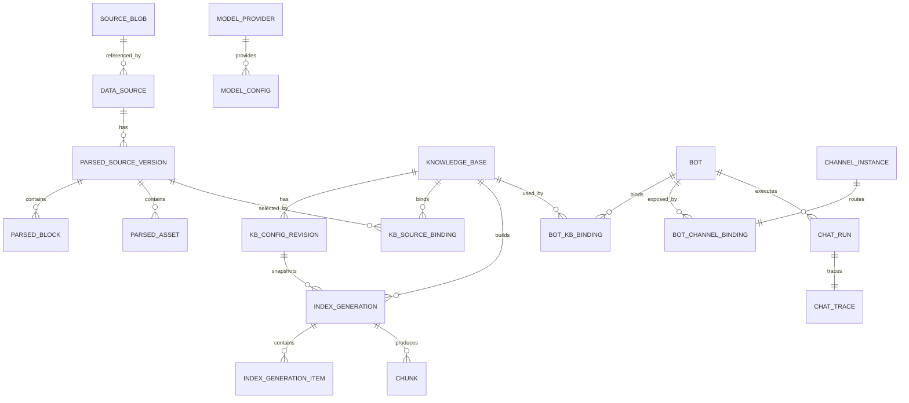

# 领域模型阶段性真源

> 文档职责：定义业务术语、实体身份、关系、不可变边界、删除语义和跨模块不变量。
> 本文件是字段命名和数据库设计的上游真源。

## 1. 核心术语

### 1.1 数据源域

| 中文名称 | 代码名称 | 含义 |
|---|---|---|
| 文件对象 | `SourceBlob` | 按 SHA-256 标识的一份物理原始文件，负责存储引用计数 |
| 数据源 | `DataSource` | 用户看到的逻辑原始文件记录，保存名称、路径、来源和文件对象引用 |
| 解析版本 | `ParsedSourceVersion` | 某数据源使用确定 Parser 和参数产生的一次不可变解析结果 |
| 解析块 | `ParsedBlock` | MinerU/Parser 标准化后的标题、段落、表格、公式、图片等结构块 |
| 解析资产 | `ParsedAsset` | 图片、表格图、页面图、公式资源等可引用资产 |

`DataSource` 不是知识库文档，`ParsedSourceVersion` 也不是 chunk。解析模块只负责把原始文件变成可复用、可追溯的标准化内容。

### 1.2 知识库域

| 中文名称 | 代码名称 | 含义 |
|---|---|---|
| 知识库 | `KnowledgeBase` | 一套独立的数据源集合、构建配置和检索配置 |
| 数据源绑定 | `KnowledgeBaseSourceBinding` | 知识库对某个具体解析版本的引用 |
| 配置修订 | `KnowledgeBaseConfigRevision` | 一次不可变知识库配置快照 |
| 构建代次 | `IndexGeneration` | 使用确定配置修订构建的一套 chunks 和索引 |
| 构建项 | `IndexGenerationItem` | 某解析版本在某构建代次中的处理结果 |
| 检索块 | `Chunk` | 用于检索、上下文和引用的知识单元 |
| 父块/子块 | `ParentChunk` / `ChildChunk` | Parent-Child 索引结构中的上下文块和召回块 |

知识库绑定的是不可变 `parsedSourceVersionId`，不是“最新数据源”。同一个解析版本可被多个知识库复用，但每个知识库独立分块、Embedding 和建索引。

### 1.3 模型、机器人和渠道域

| 中文名称 | 代码名称 | 含义 |
|---|---|---|
| 模型供应商 | `ModelProvider` | API 协议、地址和加密凭据配置 |
| 模型配置 | `ModelConfig` | 一个可测试、可引用的 LLM/Embedding/Rerank/Vision 能力 |
| 机器人 | `Bot` | 回答模型、多库融合、记忆、兜底和引用策略的集合 |
| 机器人知识库绑定 | `BotKnowledgeBaseBinding` | 机器人对知识库的引用、优先级和启用状态 |
| 渠道实例 | `ChannelInstance` | 某种渠道适配器的一份实际配置和凭据 |
| 机器人渠道绑定 | `BotChannelBinding` | 渠道实例到机器人的路由关系 |
| 会话 | `Conversation` | 由机器人、渠道和 conversationId 标识的短期对话 |
| 问答运行 | `ChatRun` | 一次完整检索、融合、生成和引用过程 |
| 问答 Trace | `ChatTrace` | 对 ChatRun 各阶段输入、输出、耗时和错误的可观测记录 |

### 1.4 任务域

| 中文名称 | 代码名称 | 含义 |
|---|---|---|
| 业务操作 | `Operation` | 用户或系统发起的一次有业务含义的异步操作 |
| 执行任务 | `OperationTask` | Operation 的当前执行和重试状态 |
| 发布事件 | `TaskOutboxEvent` | 事务提交后待发布到 Celery 的可靠消息 |

Celery task ID 只是基础设施标识，不能替代 operation ID 或业务对象状态。

## 2. 关系图

## 3. 身份、版本和时间

- 所有业务主键使用 UUID，由后端生成。
- API 字段必须使用完整名称：`dataSourceId`、`parsedSourceVersionId`、`knowledgeBaseId`、`indexGenerationId`、`botId`。
- 禁止用一个模糊的 `documentId` 同时指代原始数据源、解析版本和知识库构建项。
- 所有可编辑聚合根保存 `revision`，从 1 递增，用于乐观并发控制。
- 不可变快照保存 `createdAt`，不得原地覆盖。
- 时间在 PostgreSQL 使用带时区类型并统一存 UTC；界面按浏览器时区显示。
- 展示名称可以修改，业务关联只能依赖 ID。

## 4. 不可变边界

以下对象创建后只追加、不原地改写：

- `SourceBlob` 的二进制内容和 SHA-256。
- `ParsedSourceVersion` 的 Parser、参数快照、标准化内容和来源映射。
- `KnowledgeBaseConfigRevision`。
- 已进入构建的 `IndexGeneration` 配置快照。
- `Chunk` 的文本、来源范围、Embedding 模型和 generation 归属。
- 已完成 `ChatRun` 的请求/回答/引用快照。

需要变化时创建新版本或新代次。这样才能回答“当时为什么得到这个答案”，并避免重建过程中污染活动索引。

`IndexGeneration` 在未激活的暂存阶段允许追加同一配置修订下的重试产物；一旦设置 `activatedAt`，其 item、chunks、关键词和向量集合全部冻结，后续修复必须创建继任 generation。

## 5. 配置修订和活动指针

`KnowledgeBase` 至少保存：

- `pendingBuildConfigRevisionId`：用户当前已保存、准备构建但尚未发布的构建配置修订。
- `pendingRetrievalRevisionId`：与待构建配置配套、等待同一 generation 激活的检索配置修订；仅在构建期变化导致当前索引不兼容时存在。
- `activeGenerationId`：运行时唯一可检索代次。
- `lastSuccessfulGenerationId`：最近成功或部分成功代次。

运行时不能直接读取“表单当前值”决定如何解释活动 chunks。构建期配置必须从活动 generation 的配置快照读取；查询期检索配置从 `activeRetrievalRevisionId` 读取，并写入每次 Trace。每个 generation 同时记录其目标 retrieval revision，激活事务同时切换 generation 和检索修订，防止不兼容参数提前作用于旧索引。

## 6. 删除语义

第一版统一采用“立即业务不可见 + 异步资源清理 + 保留最小墓碑”的删除语义：

1. API 删除成功后设置 `deletedAt`，对象立即不能再被新操作引用。
2. 运行中的任务不能删除目标；必须等待结束，或取消允许取消的任务。
3. 文件、解析产物、chunks 和向量由清理任务释放。
4. 为保证历史日志可读，数据库保留 ID、当时名称、类型和删除时间等最小墓碑。
5. 历史 Trace 保存引用快照；资源已清理时显示“来源已删除/已过期”，不能跳到错误对象。

引用阻止规则：

- 被知识库活动代次、待构建修订或保留期内历史引用使用的解析版本不能物理清理。
- 被机器人引用的知识库不能删除；后端返回绑定机器人清单，管理员必须先显式解除绑定。
- 被业务对象引用的模型不能停用或删除。
- 渠道或机器人删除不能删除历史 ChatRun。

## 7. 核心不变量

### 7.1 数据源和解析

- 一个解析版本只属于一个数据源。
- 解析成功内容由 `sourceSha256 + parserCode + parserVersion + configHash` 唯一说明。
- 解析版本一旦成功不能覆盖；重新解析产生新版本号。
- 只有 `succeeded` 或 `degraded` 的解析版本可以进入知识库选择器。

### 7.2 知识库

- 一个知识库至少选择一个可用解析版本后才能提交首次构建。
- 同一知识库同一配置修订不能重复绑定同一个解析版本。
- 每个知识库拥有独立 chunks、关键词索引命名空间和 Chroma collection 代次。
- 两个知识库选择同一个 Embedding 模型不代表共享向量或运行状态。
- 任何失败构建都不能覆盖活动 generation。

### 7.3 模型

- 业务页面只能引用类型匹配、已启用且验证通过的模型。
- Embedding 维度属于构建代次，不能在同一 collection 中混用。
- 被引用模型的调用目标、模型名、协议和维度相关参数不可原地修改。

### 7.4 机器人和问答

- 一个机器人至少绑定一个可检索知识库且选择一个 LLM 后才能保存为可调用配置。
- 不同知识库原始分数禁止直接跨库比较。
- “没有检索结果”和“检索发生错误”是不同结果。
- 引用只能来自最终进入 Prompt 的上下文；不得为模型常识兜底伪造知识库引用。
- 会话历史只用于指代消解，不作为企业事实来源。

### 7.5 渠道

- 一个第一版渠道实例只路由一个机器人。
- API Key 只保存哈希，明文只在创建/轮换时展示一次。
- 重复 request ID 必须返回同一操作结果，不能重复回答或重复导入。
- 渠道上传数据源不能绕过解析模块，也不能自动改变知识库活动索引。

## 8. 状态分轴原则

禁止把多个独立维度塞入一个 `status`：

- 数据源可用性与解析版本执行状态分开。
- 知识库生命周期、构建状态和启用状态分开。
- 模型启用状态、配置验证状态和最近健康测试分开。
- 任务业务状态与供应商原始状态分开。
- ChatRun 的检索结果、兜底结果和整体执行状态分开。

界面可以根据多个字段计算中文展示状态，但该派生状态不能反向成为数据库真源。

## 9. 跨模块快照

为了历史可追溯，以下运行记录保存当时快照，而不是只保存外键：

- 解析任务：Parser code/version、参数、MinerU task ID、供应商响应摘要。
- 构建代次：数据源绑定、Embedding 模型、分块和索引配置。
- ChatRun：机器人配置修订、知识库活动代次、实际检索参数、模型标识、Prompt、上下文和引用。
- 审计日志：操作者、命令、目标、变更前后摘要和 traceId。

快照中的密钥、Token、签名 URL 和本地绝对路径必须移除或脱敏。

## 10. 术语禁用表

| 禁止模糊说法 | 必须改成 |
|---|---|
| 文档 | 数据源、解析版本、构建项或 chunk，按真实对象选择 |
| 数据库 | PostgreSQL、Chroma 或知识库，按真实含义选择 |
| 最新解析结果 | 明确 `parsedSourceVersionId` |
| 当前索引 | 明确 `activeGenerationId` |
| 模型 | 明确 LLM、Embedding、Rerank 或 Vision 模型配置 |
| 失败了 | 明确失败阶段、业务错误码、是否可重试 |
| 命中率代表准确率 | 命中率只代表最终上下文非空，不代表答案正确 |

## 11. 领域模型验收

- 任一引用都能从 chunk 追溯到构建代次、解析版本、原始数据源和资产范围。
- 任一历史回答都能说明使用了哪个机器人配置、哪些知识库代次和哪些模型。
- 同一原始文件重新解析不会静默改变现有知识库。
- 同一知识库重建失败时仍能读取旧活动代次。
- 删除对象后历史日志不会错误跳转到另一个同名对象。
- API、数据库和前端不存在含义不明的通用 `documentId`。
